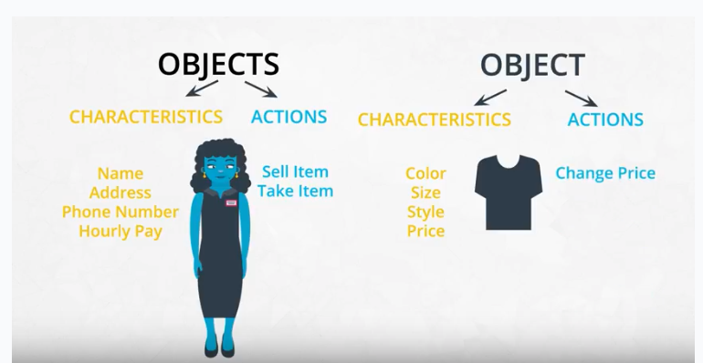

Procedural vs Object-Oriented Programming
---
---
[video: introduction](https://www.youtube.com/watch?v=5DfFaAl1Wmc)

[video](https://www.youtube.com/watch?v=psXD_J8FnCQ)

**Objects are defined by characteristics and actions**

Here is a reminder of what is a characteristic and what is an action.

**Characteristics and Actions in English Grammar**

Another way to think about characteristics and actions is in terms of English grammar. A characteristic would be a noun. On the other hand, an action would be a verb.

Let's pick something from the real-world: a dog. A few characteristics could be the dog's weight, color, breed, and height. These are all nouns. What actions would a dog take? A dog can bark, run, bite and eat. These are all verbs.
