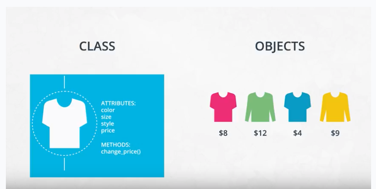

Object-Oriented Programming (OOP) Vocabulary
---
---

[video](https://www.youtube.com/watch?v=yvVMJt09HuA)

* class - a blueprint consisting of methods and attributes

* object - an instance of a class. It can help to think of objects as something in the real world like a yellow pencil, a small dog, a blue shirt, etc. However, as you'll see later in the lesson, objects can be more abstract.

* attribute - a descriptor or characteristic. Examples would be color, length, size, etc. These attributes can take on specific values like blue, 3 inches, large, etc.

* method - an action that a class or object could take

* OOP - a commonly used abbreviation for object-oriented programming

* encapsulation - one of the fundamental ideas behind object-oriented programming is called encapsulation: you can combine functions and data all into a single entity. In object-oriented programming, this single entity is called a class. Encapsulation allows you to hide implementation details much like how the scikit-learn package hides the implementation of machine learning algorithms.

In English, you might hear an attribute described as a property, description, feature, quality, trait, or characteristic. All of these are saying the same thing.

Here is a reminder of how a class, object, attributes and methods relate to each other.

