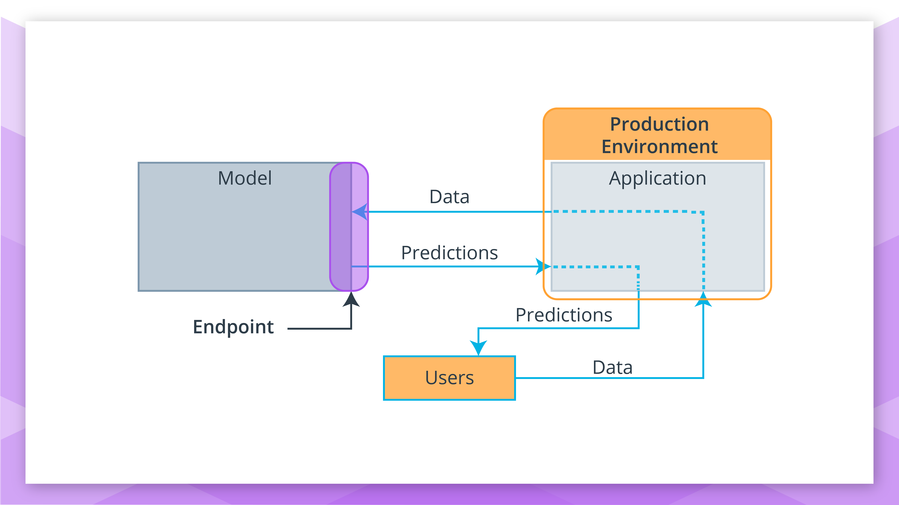
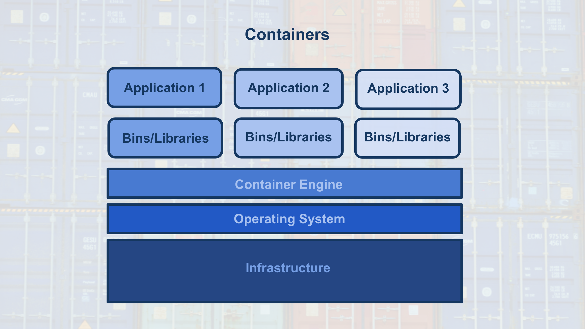
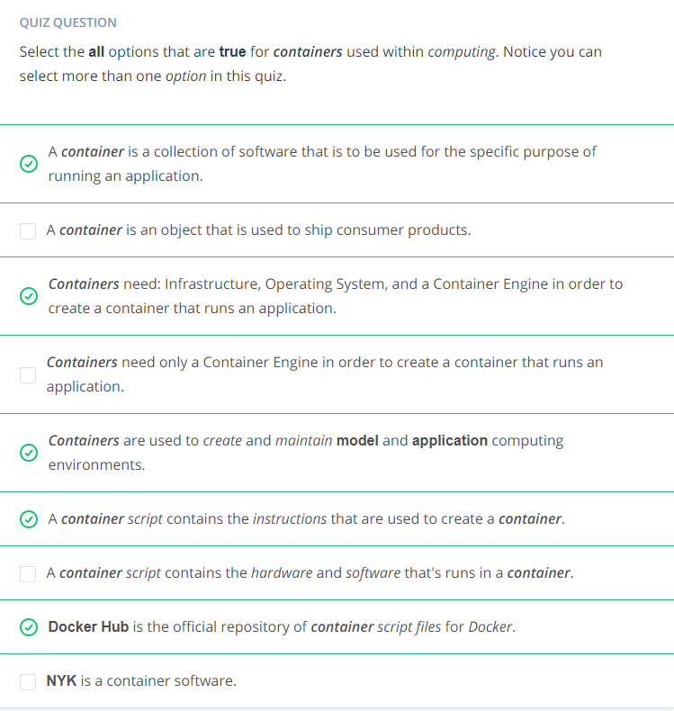

Containers
---
---

**Model, Application, and Containers**

When we discussed the production environment, it was composed of two primary programs, the model and the application, that communicate with each other through the endpoint (interface).

* The model is simply the Python model that's created, trained, and evaluated in the Modeling component of the machine learning workflow.

* The application is simply a web or software application that enables the application users to use the model to retrieve predictions.

Both the model and the application require a computing environment so that they can be run and available for use. One way to create and maintain these computing environments is through the use of containers.

* Specifically, the model and the application can each be run in a container computing environment. The containers are created using a script that contains instructions on which software packages, libraries, and other computing attributes are needed in order to run a software application, in our case either the model or the application.

**Containers Defined**

* A container can be thought of as a standardized collection/bundle of software that is to be used for the specific purpose of running an application.

As stated above container technology is used to create the model and application computational environments associated with deployment in machine learning. A common container software is Docker. Due to its popularity sometimes Docker is used synonymously with containers.

**Containers Explained**

Often to first explain the concept of containers, people tend to use the analogy of how Docker containers are similar to shipping containers.

* Shipping containers can contain a wide variety of products, from food to computers to cars.

* The structure of a shipping container provides the ability for it to hold different types of products while making it easy to track, load, unload, and transport products worldwide within a shipping container.

Similarly Docker containers:

* Can contain all types of different software.
* The structure of a Docker container enables the container to be created, saved, used, and deleted through a set of common tools.
* The common tool set works with any container regardless of the software the container contains.

**Container Structure**

The image below shows the basic structure of a container, you have:

* The underlying computational infrastructure which can be: a cloud provider’s data center, an on-premise data center, or even someone’s local computer.
* Next, you have an operating system running on this computational infrastructure, this could be the operating system on your local computer.
* Next, there’s the container engine, this could be Docker software running on your local computer. The container engine software enables one to create, save, use, and delete containers; for our example, it could be Docker running on a local computer.
* The final two layers make up the composition of the containers.
    * The first layer of the container is the libraries and binaries required to launch, run, and maintain the next layer, the application layer.
*  The image below shows three containers running three different applications.

This architecture of containers provides the following advantages:

1. Isolates the application, which increases security.

2. Requires only software needed to run the application, which uses computational resources more efficiently and allows for faster application deployment.

3. Makes application creation, replication, deletion, and maintenance easier and the same across all applications that are deployed using containers.

4. Provides a more simple and secure way to replicate, save, and share containers.

As indicated by the fourth advantage of using containers, a container script file is used to create a container.

* This text script file can easily be shared with others and provides a simple method to replicate a particular container.

* This container script is simply the instructions (algorithm) that is used to create a container; for Docker these container scripts are referred to as dockerfiles.

This is shown with the image below, where the container engine uses a container script to create a container for an application to run within. These container script files can be stored in repositories, which provide a simple means to share and replicate containers. For Docker, the [Docker Hub](https://hub.docker.com/explore/) is the official repository for storing and sharing dockerfiles. Here's an example of a [dockerfile](https://github.com/pytorch/pytorch/blob/master/docker/pytorch/Dockerfile) that creates a docker container with Python 3.6 and PyTorch installed.

Summary Quiz

