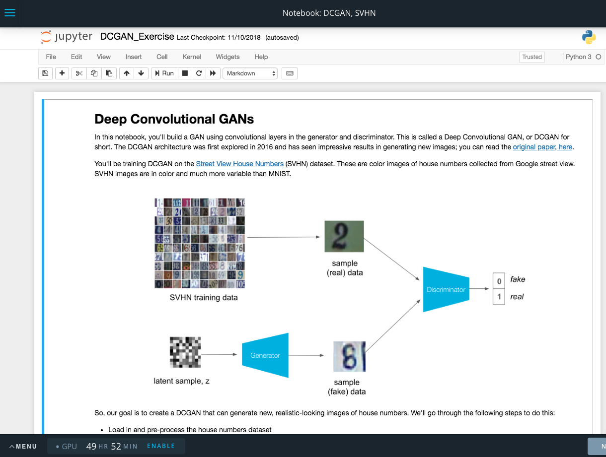

**Expert Interview on Containers**

We will be talking with Jesse Swidler, a senior software engineer at Udacity, to learn more about containers. He will tell us more about what they are, what they do, and how they make his job easier. He'll even describe how we use containers when we work within a Workspace.

When you work on exercises and projects within a Nanodegree, often you will work within a Workspace environment within the classroom. Below you will find an image of a Workspace environment that contains a Jupyter notebook. The Workspace environment makes use of containers so that you can run PyTorch, Numpy, Pandas, without having to install those Python packages.

Example Workspace

[Watch Expert Interview Video](https://www.youtube.com/watch?v=XimuK3WHOH4)
