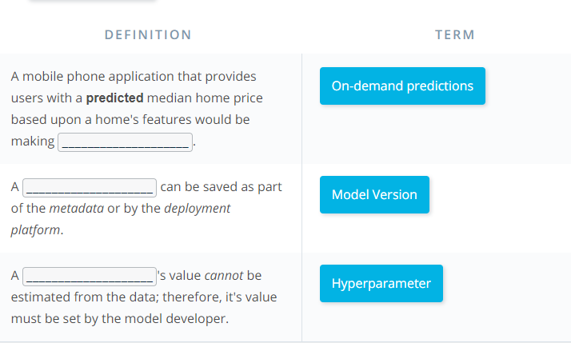
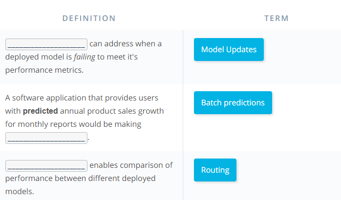

Characteristics of Deployment and Modeling
---

Recall that:
>
Deployment to production can simply be thought of as a method that integrates a machine learning model into an existing production environment so that the model can be used to make decisions or predictions based upon data input into this model.

>
Also remember that a production environment can be thought of as a web, mobile, or other software application that is currently being used by many people and must respond quickly to those users’ requests.

Keeping these things in mind, there are a number of characteristics of deployment and modeling that I’m going to introduce here. These concepts are introduced now to provide you with familiarity with these concepts for when you see them discussed in future lessons. Specifically, these concepts are provided as features that are made easier to use within cloud platforms services than if implemented with your own code.

Characteristics of Modeling

Hyperparameters

In machine learning, a hyperparameter is a parameter whose value cannot be estimated from the data.

* Specifically, a hyperparameter is not directly learned through the estimators; therefore, their value must be set by the model developer.

* This means that hyperparameter tuning for optimization is an important part of model training.

* Often cloud platform machine learning services provide methods that allow for automatic hyperparameter tuning for use with model training.

If the machine learning platform fails to offer an automatic hyperparameter option, one option is to use methods from [scikit-learn](https://scikit-learn.org/stable/) Python library for hyperparameter tuning. Scikit-learn is a free machine learning Python library that includes methods that help with [hyperparameter tuning](https://scikit-learn.org/stable/modules/grid_search.html#).

Characteristics of Deployment

*Model Versioning*

One characteristic of deployment is the version of the model that is to be deployed.

* Besides saving the model version as a part of a model’s metadata in a database, the deployment platform should allow one to indicate a deployed model’s version.
This will make it easier to maintain, monitor, and update the deployed model.

*Model Monitoring*

Another characteristic of deployment is the ability to easily monitor your deployed models.

* Once a model is deployed you will want to make certain it continues to meet its performance metrics; otherwise, the application may need to be updated with a better performing model.

*Model Updating and Routing*

The ability to easily update your deployed model is another characteristic of deployment.

* If a deployed model is failing to meet its performance metrics, it's likely you will need to update this model.

If there's been a fundamental change in the data that’s being input into the model for predictions; you'll want to collect this input data to be used to update the model.

* The deployment platform should support routing differing proportions of user requests to the deployed models; to allow comparison of performance between the deployed model variants.

Routing in this way allows for a test of a model performance as compared to other model variants.

*Model Predictions*

Another characteristic of deployment is the type of predictions provided by your deployed model. There are two common types of predictions:

* On-demand predictions
* Batch predictions

On-Demand Predictions
* On-demand predictions might also be called:
    * online,
    * real-time, or
    * synchronous predictions
* With these type of predictions, one expects:
    * a low latency of response to each prediction request,
    * but allows for possibility high variability in request volume.
* Predictions are returned in the response from the request. Often these requests and responses are done through an API using JSON or XML formatted strings.
* Each prediction request from the user can contain one or many requests for predictions. Noting that many is limited based upon the size of the data sent as the request. Common cloud platforms on-demand prediction request size limits can range from 1.5(ML Engine) to 5 Megabytes (SageMaker).

*On-demand predictions* are commonly used to provide customers, users, or employees with real-time, online responses based upon a deployed model. Thinking back on our magic eight ball web application example, users of our web application would be making on-demand prediction requests.

*Batch Predictions*

* Batch predictions might also be called:
    * asynchronous, or
    * batch-based predictions.
* With these type of predictions, one expects:
    * high volume of requests with more periodic submissions
    * so latency won’t be an issue.
* Each batch request will point to specifically formatted data file of requests and will return the predictions to a file. Cloud services require these files will be stored in the cloud provider’s cloud.
* Cloud services typically have limits to how much data they can process with each batch request based upon limits they impose on the size of file you can store in their cloud storage service. For example, Amazon’s SageMaker limits batch predictions requests to the size limit they enforce on an object in their S3 storage service.

*Batch predictions* are commonly used to help make business decisions. For example, imagine a business uses a complex model to predict customer satisfaction across a number of their products and they need these estimates for a weekly report. This would require processing customer data through a batch prediction request on a weekly basis.

Quiz:

