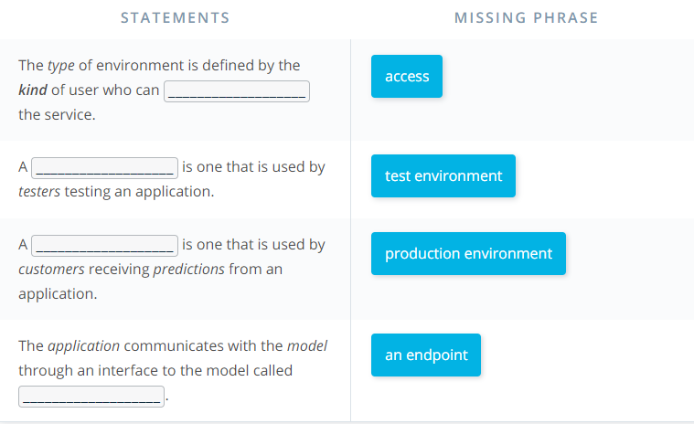
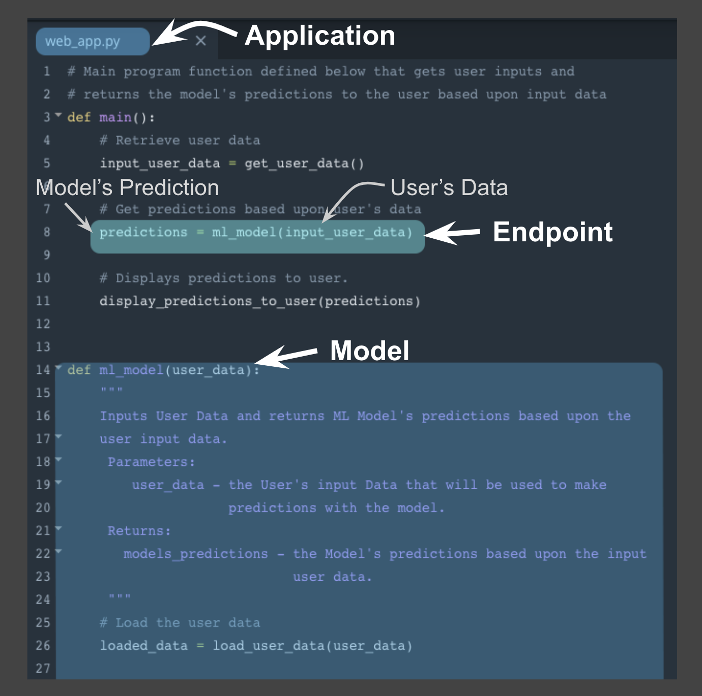
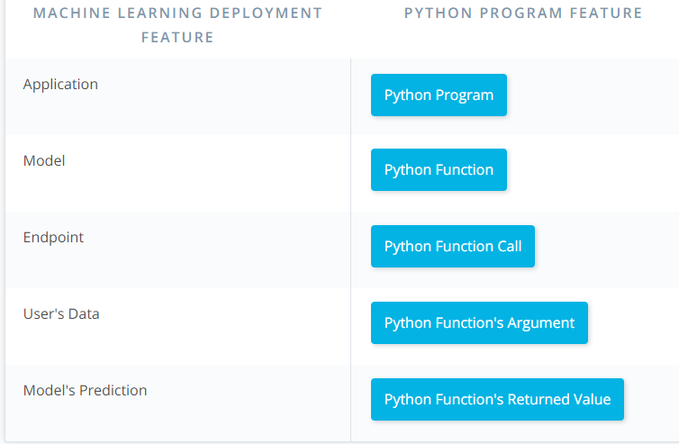
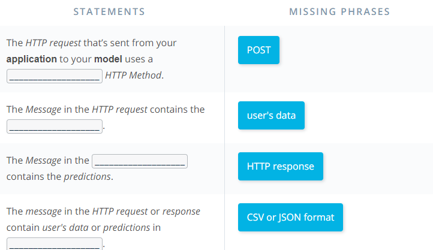

Production Environments
---
---

[Watch Video](https://www.youtube.com/watch?v=BH23Me3bbF4)

**Production Environment and the Endpoint**

When we discussed the production environment, the endpoint was defined as the **interface** to the model. This interface (endpoint) facilitates an ease of communication between the model and the application. Specifically, this interface (endpoint)

* Allows the application to send user data to the model and
* Receives predictions back from the model based upon that user data.

**Model, Application, and Endpoint**

One way to think of the endpoint that acts as this interface, is to think of a Python program where:

* the endpoint itself is like a function call
* the function itself would be the model and
* the Python program is the application.
The image above depicts the association between a Python program and the endpoint, model, and application.

* the endpoint: line 8 function call to ml_model
* the model: beginning on line 14 function definition for ml_model
* the application: Python program web_app.py

Using this example above notice the following:

* Similar to a function call the endpoint accepts user data as the input and returns the model’s prediction based upon this input through the endpoint.

* In the example, the user data is the input argument and the prediction is the returned value from the function call.

* The application, here the python program, displays the model’s prediction to the application user.

This example highlights how the endpoint itself is just the interface between the model and the application; where this interface enables users to get predictions from the deployed model based on their user data.

Next we'll focus on how the endpoint (interface) facilitates communication between application and model.

**Endpoint and REST API**

Communication between the application and the model is done through the endpoint (interface), where the endpoint is an Application Programming Interface (API).

* An easy way to think of an API, is as a set of rules that enable programs, here the application and the model, to communicate with each other.
* In this case, our API uses a REpresentational State Transfer, REST, architecture that provides a framework for the set of rules and constraints that must be adhered to for communication between programs.
* This REST API is one that uses HTTP requests and responses to enable communication between the application and the model through the endpoint (interface).
* Noting that both the HTTP request and HTTP response are communications sent between the application and model.

The HTTP request that’s sent from your application to your model is composed of four parts:

* Endpoint
    * This endpoint will be in the form of a URL, Uniform Resource Locator, which is commonly known as a web address.
* HTTP Method
    * Below you will find four of the HTTP methods, but for purposes of deployment our application will use the POST method only.
* HTTP Headers
    * The headers will contain additional information, like the format of the data within the message, that’s passed to the receiving program.
* Message (Data or Body)
    * The final part is the message (data or body); for deployment will contain the user’s data which is input into the model.

The HTTP response sent from your model to your application is composed of three parts:

* HTTP Status Code
    * If the model successfully received and processed the user’s data that was sent in the message, the status code should start with a 2, like 200.

* HTTP Headers
    * The headers will contain additional information, like the format of the data within the message, that’s passed to the receiving program.

* Message (Data or Body)
    * What’s returned as the data within the message is the prediction that’s provided by the model.

This prediction is then presented to the application user through the application. The endpoint is the interface that enables communication between the application and the model using a REST API.

As we learn more about RESTful API, realize that it's the application’s responsibility:

* To format the user’s data in a way that can be easily put into the HTTP request message and used by the model.
* To translate the predictions from the HTTP response message in a way that’s easy for the application user’s to understand.
Notice the following regarding the information included in the HTTP messages sent between application and model:

* Often user's data will need to be in a CSV or JSON format with a specific ordering of the data that's dependent upon the model used.
* Often predictions will be returned in CSV or JSON format with a specific ordering of the returned predictions dependent upon the model used.

Summary Quize

