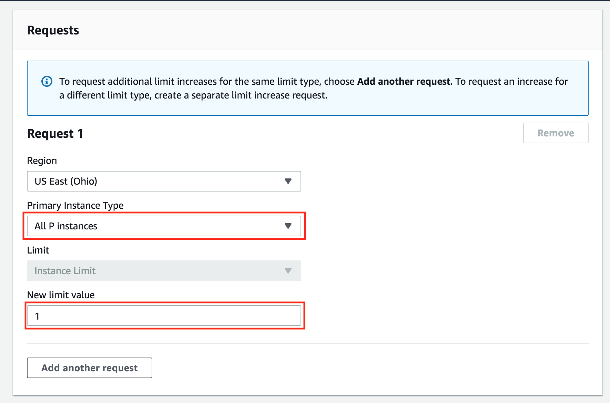

Introduction to Amazon SageMaker
---

[Watch Video](https://www.youtube.com/watch?v=nJCc4_9-iAQ)

*Note*: Amazon is constantly iterating and improving the various services that they offer. Sometimes this involves changes to the way certain things look, however, the functionality should be the same. So in the screenshots and videos that follow, if your screen doesn't look exactly the same, don't worry!

Create an AWS Account
---

Open a regular AWS account (if you don't already have one) following the instructions via the [Amazon Web Service Help Center](https://aws.amazon.com/premiumsupport/knowledge-center/create-and-activate-aws-account/)

Get Access to GPU Instances
---
What is EC2?
Amazon Web Services has a service called Elastic Compute Cloud (EC2), which allows you to launch virtual servers (or “instances”), including instances with attached GPUs. The specific type of GPU instance you should launch for this tutorial is called “p2.xlarge”.

What is a Amazon Machine Image?

Amazon Machine Image or AMI is a template for an operating system and basic services (e.g., an application server and specific applications). By running an AMI instance, the AMI will be running "as a virtual server in the cloud" (as per [AWS Documentation](https://docs.aws.amazon.com/AWSEC2/latest/UserGuide/ec2-instances-and-amis.html)).

We will use this [AMI image](https://aws.amazon.com/marketplace/pp/B077GF11NF) to define the operating system for your instance and to make use of its pre-installed software. In order to use this AMI, you must change your AWS region that is closest to you):

What is a P2 instance?

P2 are powerful and scalable parallel processing GPU instances. You can read more about these on AWS Documentation.

**DO NOT FORGET TO SHUT DOWN YOUR EC2 INSTANCE or YOU WILL RUN OUT OF YOUR FREE PROMO CREDITS.**

Your credits will be used for any inactive running instances. If you are in the middle of the project and need to step away, **PLEASE SHUT DOWN YOUR EC2 INSTANCE** You can re-instantiate later. We have provided adequate credits to allow you to complete your projects.

**How to increase your instance limits to complete the project**

**View Your Current Limit**

After changing your AWS region, view your [EC2 Service Limit report at this link](https://console.aws.amazon.com/ec2/v2/home?#Limits), and find your "Current Limit" for the p2.xlarge instance type. By default, AWS sets a limit of 0 on the number of p2.xlarge instances a user can run, which effectively prevents you from launching this instance.

**Submit a Limit Increase Request**
If your limit of p2.xlarge instances is 0, you'll need to increase the limit before you can launch an instance. From the EC2 Service Limits page, CLICK TO EDIT Calculate vCPU limit on top.

The following screen pops up.

In the Instance type search for p2.xlarge and the Instance count to 1, verify the New limit is showing 4 vCPUs and then click on Request limit increase

Note: You won't be charged for requesting a limit increase. AWS will only charge you once you have launched the instance.

This will open the following screen.

Click on the Service limit increase if it is not already selected.

In Requests section pick your "Primary Instance type" as "All P instances" and "1" for "New limit value"

Note: If you have never launched an instance of any type on AWS, you might receive an email from AWS Support asking you to initialize your account by creating an instance before they approve the limit increase.

**IMPORTANT NOTICE: This is the current AWS UI as of March 26th, 2020. The AWS UI is subject to change on a regular basis. We advise students to refer to AWS documentation for the above process.**
