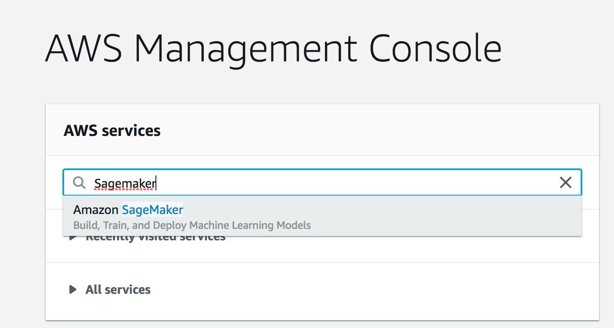

Setting up a Notebook Instance
The first thing we are going to need to do is set up a notebook instance!

This will be the primary way in which we interact with the SageMaker ecosystem. Of course, this is not the only way to interact with SageMaker's functionality, but it is the way that we will use in this module.

The video below guides you through setting up your first notebook instance. Also, if you prefer to read the instructions instead, these have been provided underneath the video.

**Note**: Once a notebook instance has been set up, by default, it will be InService which means that the notebook instance is running. This is important to know because the cost of a notebook instance is based on the length of time that it has been running. This means that once you are finished using a notebook instance you should Stop it so that you are no longer incurring a cost. Don't worry though, you won't lose any data provided you don't delete the instance. Just start the instance back up when you have time and all of your saved data will still be there.

[Watch Video](https://www.youtube.com/watch?v=TRUCNy5Eqjc)

**Searching for SageMaker**

Your main console page may look slightly different than in the above example. You should still be able to find Amazon SageMaker by either:

1. Clicking on All Services then scrolling down and navigating to Machine Learning> Amazon SageMaker, or
2. By searching for SageMaker, as in the below screenshot (and clicking on it).

**Creating and Running a Notebook Instance**

First, start by logging in to the [AWS console](https://console.aws.amazon.com/), opening the SageMaker dashboard, selecting Notebook Instances and clicking on Create notebook instance.

You may choose any name you would like for your notebook. Also, using ml.t2.medium should be all that is necessary for the notebooks that you will encounter in this module. In addition, an ml.t2.medium instance is covered under the free tier.

Next, under IAM role select Create a new role. You should get a pop-up window that looks like the one below. The only change that needs to be made is to select None under S3 buckets you specify, as is shown in the image below.

Once you have finished setting up the role for your notebook, your notebook instance settings should look something like the image below.

**Note**: Your notebook name may be different than the one displayed and the IAM role that appears will be different.

Now scroll down and click on Create notebook instance.

Once your notebook instance has started and is accessible, click on open to get to the Jupyter notebook main page.
