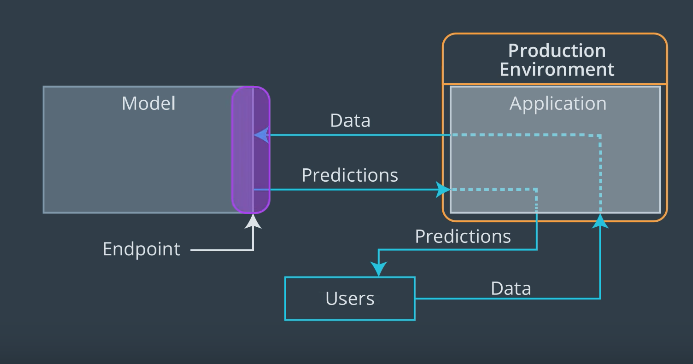

Deploying a Model in SageMaker
---
[watch video](https://www.youtube.com/watch?v=g_GYZpcVcFE)

In this lesson, we're going to take a look at how we can use a model that has been created in SageMaker. We will do this by first deploying our model. For us, this means using SageMaker's functionality to create an endpoint that will be used as a way to send data to our model.

>
Recall, from the first lesson in this section, that an endpoint is basically a way to allow a model and an application to communicate. An application, such as a web app, will be responsible for accepting user input data, and through an endpoint we can send that data to our model, which will produce predictions that can be sent back to our application!

For our purposes **an endpoint is just a URL**. Instead of returning a web page, like a typical url, this endpoint URL returns the results of performing inference. In addition, we are able to send data to this URL so that our model knows what to perform inference on. We won't go too far into the details of how this is all set up since SageMaker does most of the heavy lifting for us.

An important aspect that we will encounter is that SageMaker endpoints are secured. In this case, that means that only other AWS services with permission to access SageMaker endpoints can do so.

To start with, we won't need to worry about this too much since we will be working inside of a SageMaker notebook and so we will be able to access our deployed endpoints easily.

Later on we will talk about how to set things up so that a simple web app, which doesn't need to be given special permission, can access our SageMaker endpoint.
