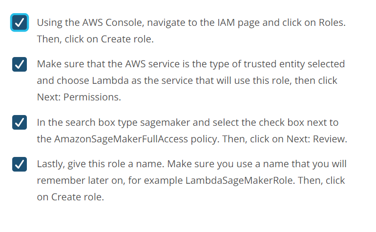
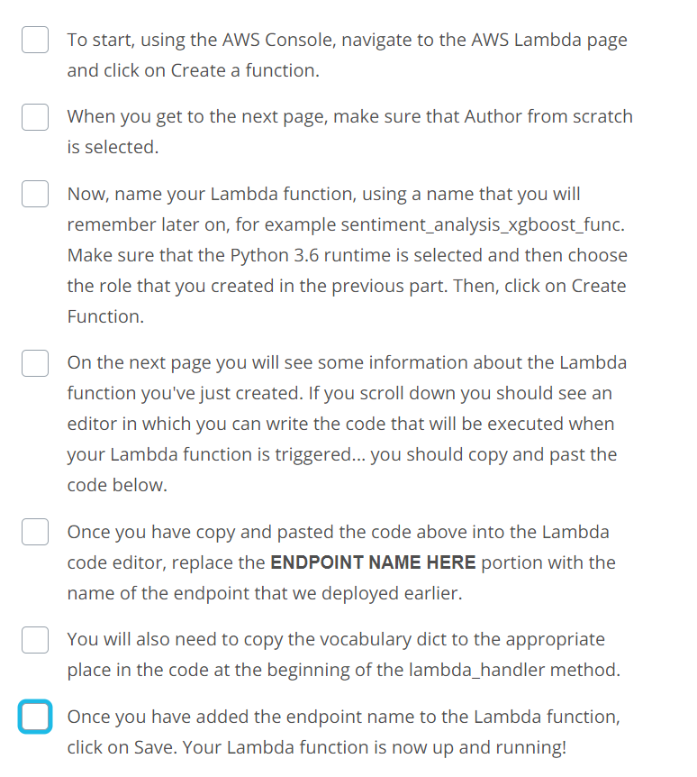

Building a Lambda Function

[Watch Video](https://www.youtube.com/watch?v=jOXETK4AerU)


In general, a Lambda function is an example of a 'Function as a Service'. It lets you perform actions in response to certain events, called triggers. Essentially, you get to describe some events that you care about, and when those events occur, your code is executed.

For example, you could set up a trigger so that whenever data is uploaded to a particular S3 bucket, a Lambda function is executed to process that data and insert it into a database somewhere.

One of the big advantages to Lambda functions is that since the amount of code that can be contained in a Lambda function is relatively small, you are only charged for the number of executions.

In our case, the Lambda function we are creating is meant to process user input and interact with our deployed model. Also, the trigger that we will be using is the endpoint that we will create using API Gateway.

**Create a Lambda Function**

The steps to create a lambda function are outlined in the notebook and here, for convenience.

Setting up a Lambda function The first thing we are going to do is set up a Lambda function. This Lambda function will be executed whenever our public API has data sent to it. When it is executed it will receive the data, perform any sort of processing that is required, send the data (the review) to the SageMaker endpoint we've created and then return the result.

**Part A: Create an IAM Role for the Lambda function**

Since we want the Lambda function to call a SageMaker endpoint, we need to make sure that it has permission to do so. To do this, we will construct a role that we can later give the Lambda function.


**Part B: Create a Lambda function**

Now it is time to actually create the Lambda function. Remember from earlier that in order to process the user provided input and send it to our endpoint we need to gather two pieces of information:

1. The name of the endpoint, and
2. the vocabulary object.

We will copy these pieces of information to our Lambda function, after we create it.



lambda function:

```
# We need to use the low-level library to interact with SageMaker since the SageMaker API
# is not available natively through Lambda.
import boto3

# And we need the regular expression library to do some of the data processing
import re

REPLACE_NO_SPACE = re.compile("(\.)|(\;)|(\:)|(\!)|(\')|(\?)|(\,)|(\")|(\()|(\))|(\[)|(\])")
REPLACE_WITH_SPACE = re.compile("(<br\s*/><br\s*/>)|(\-)|(\/)")

def review_to_words(review):
    words = REPLACE_NO_SPACE.sub("", review.lower())
    words = REPLACE_WITH_SPACE.sub(" ", words)
    return words

def bow_encoding(words, vocabulary):
    bow = [0] * len(vocabulary) # Start by setting the count for each word in the vocabulary to zero.
    for word in words.split():  # For each word in the string
        if word in vocabulary:  # If the word is one that occurs in the vocabulary, increase its count.
            bow[vocabulary[word]] += 1
    return bow


def lambda_handler(event, context):

    vocab = "*** ACTUAL VOCABULARY GOES HERE ***"

    words = review_to_words(event['body'])
    bow = bow_encoding(words, vocab)

    # The SageMaker runtime is what allows us to invoke the endpoint that we've created.
    runtime = boto3.Session().client('sagemaker-runtime')

    # Now we use the SageMaker runtime to invoke our endpoint, sending the review we were given
    response = runtime.invoke_endpoint(EndpointName = '***ENDPOINT NAME HERE***',# The name of the endpoint we created
                                       ContentType = 'text/csv',                 # The data format that is expected
                                       Body = ','.join([str(val) for val in bow]).encode('utf-8')) # The actual review

    # The response is an HTTP response whose body contains the result of our inference
    result = response['Body'].read().decode('utf-8')

    # Round the result so that our web app only gets '1' or '0' as a response.
    result = round(float(result))

    return {
        'statusCode' : 200,
        'headers' : { 'Content-Type' : 'text/plain', 'Access-Control-Allow-Origin' : '*' },
        'body' : str(result)
    }
```
