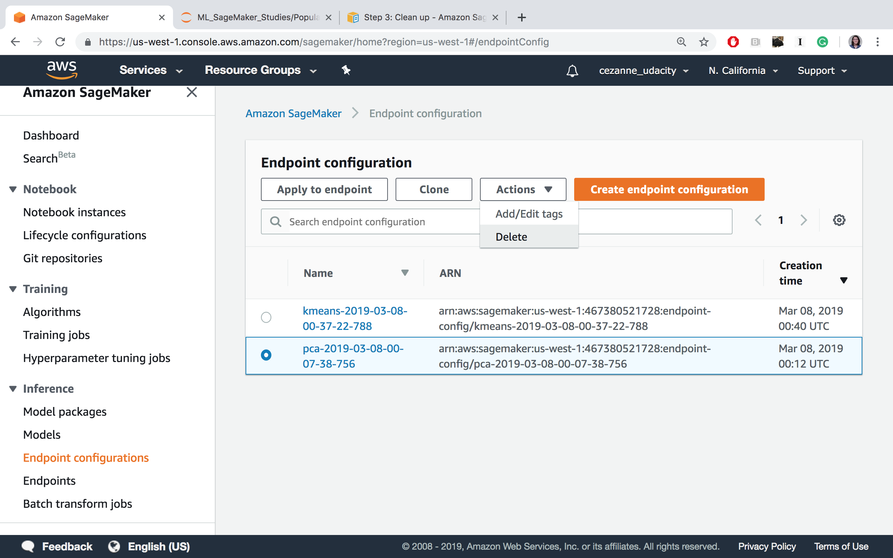
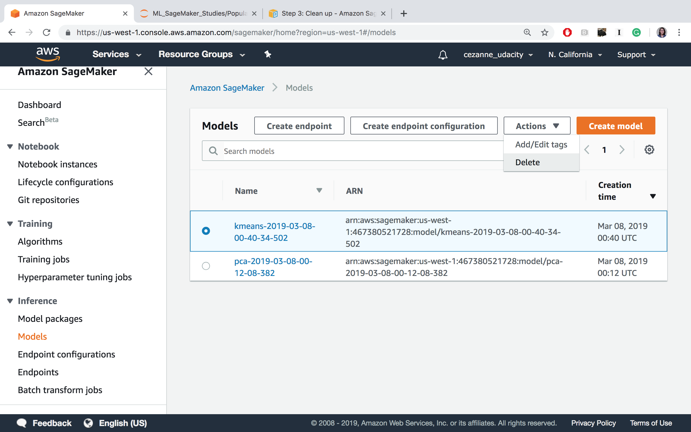

Summary
---
[watch video](https://www.youtube.com/watch?v=vMLN832942E)


Clean Up: All Resources
---
It is good practice to always clean up and delete any resources that you are no longer using. That is, after you complete an exercise, and you are done with predictions and data analysis, you should get rid of any:

* Data source in S3 that you are no longer using
* Endpoint configuration files that you no longer need
* Endpoints that you will no longer use
* CloudWatch logs that are no longer useful

**Deleting Endpoints**

In the notebook, we have usually included code to delete your endpoints after creating some predictions, for example:
```
# delete predictor endpoint
session.delete_endpoint(predictor.endpoint)
```

**Thorough Clean up**

You can find a link for instructions on cleaning up all your resources, [in this documentation](https://docs.aws.amazon.com/sagemaker/latest/dg/ex1-cleanup.html) and I will go over some of these details, next.

* Open the Amazon SageMaker console at https://console.aws.amazon.com/sagemaker/ and delete the following resources:
* The endpoint configuration.
* The model.





* Open the Amazon S3 console at https://console.aws.amazon.com/s3/ and delete or empty the bucket that you created for storing model artifacts and the training dataset.


* Open the Amazon CloudWatch console at https://console.aws.amazon.com/cloudwatch/ and delete all of the log groups that have names starting with /aws/sagemaker/.

At the end of this course, you may also choose to delete the entire notebook instance and IAM Role, but you may keep these as is, for now. In between lessons, if you are taking a break, you may want to Stop your notebook and pause it from continuously running.


Cleaning up resources at the end of an exercise or lesson is a great practice to get into!

IMPORTANT
To avoid incurring additional charges, it is suggested that you DELETE any unused notebooks and data resources on S3 and CloudWatch.
