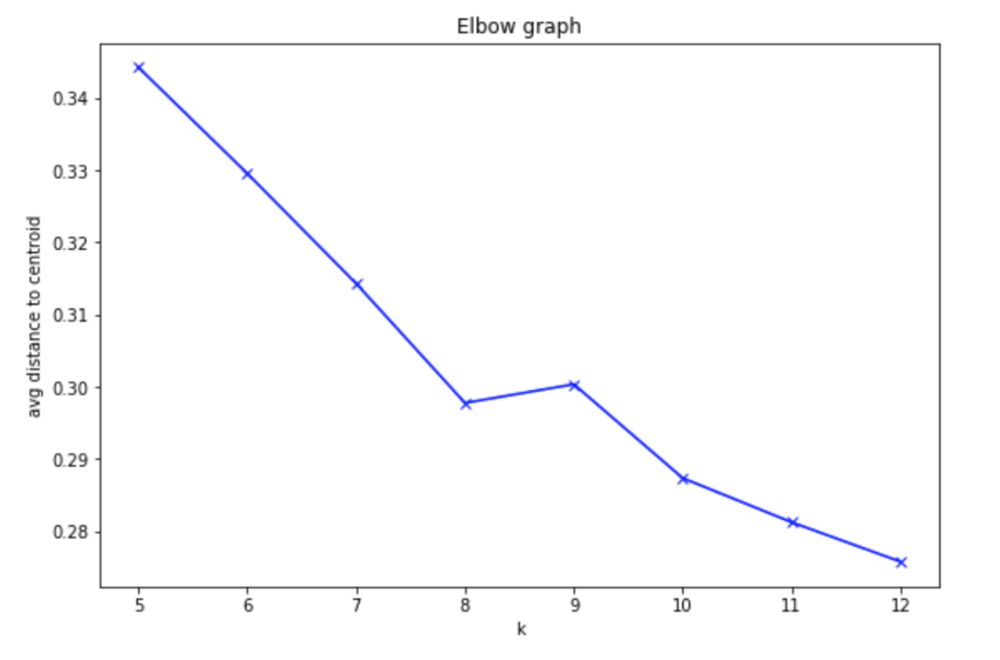

Creating a `KMeans` Estimator
---

Now that we’ve run the original data through PCA and moved from 34-dimensional data to 7-dimensional component data, we’re better prepared to actually cluster this data! So, now, I’ll ask you to use these components that we’ve gotten from our training data and cluster counties using k-means.

You'll instantiate a `KMeans` estimator, by specifying specific model arguments and passing them into a `KMeans` constructor ([documentation, here](https://sagemaker.readthedocs.io/en/stable/`KMeans`.html)). Knowing how to read documentation is an important skill for learning to create models on your own!

Here is what this exercise looks like in the main, exercise notebook:

**EXERCISE: Define a k-means model**

Your task will be to instantiate a k-means model. A `KMeans` estimator requires a number of parameters to be instantiated, which allow us to specify the type of training instance to use, and the model hyperparameters.

```
# define a `KMeans` estimator

```


General Estimator Parameters
---

From the documentation, you can see that you'll need to specify the IAM role (which we defined when creating the notebook instance), and details about the instance type to use for training.

Most of SageMaker's built-in algorithms are based off of an EstimatorBase object, which allows you to specify additional parameters. It is good practice to be specific about two additional parameters:

* output_path (str) – S3 location for saving the training result (model artifacts and output files). If not specified, results are stored to a default bucket.
* sagemaker_session (sagemaker.session.Session) – Session object which manages interactions with Amazon SageMaker APIs and any other AWS services needed.

**Model-Specific Parameters**

You'll also notice a parameter `k` for the number of clusters this model should produce as output. This parameter is specific to the k-means model, and for different models, you'll see different required model parameters.

Choosing a "Good" K
---

One method for choosing a "good" k, is to choose based on empirical data.

* A bad `k` would be one so high that only one or two very close data points are near it, and
* Another bad `k` would be one so low that data points are really far away from the centers.
You want to select a `k` such that data points in a single cluster are close together but that there are enough clusters to effectively separate the data. You can approximate this separation by measuring how close your data points are to each cluster center; the average centroid distance between cluster points and a centroid. After trying several values for k, the centroid distance typically reaches some "elbow"; it stops decreasing at a sharp rate and this indicates a good value of k.

The graph below indicates the average distance—between our component data and cluster centroids—for a value of `k` between 5 and 12.


Training Job
---
After creating a `KMeans` estimator, I also want you to proceed with creating a training job. You'll have to format your data correctly for this job and make sure you are passing in the reduced-dimensionality training data. It may be helpful to reference the PCA training job code.

Here is what these exercises look like in the exercise notebook:

**EXERCISE: Create formatted, k-means training data**

Just as before, you should convert the counties_transformed df into a numpy array and then into a RecordSet. This is the required format for passing training data into a `KMeans` model.

```
# convert the transformed dataframe into record_set data
```

**EXERCISE: Train the k-means model**

Pass in the formatted training data and train the k-means model.
```
%%time
# train `KMeans`
```

Getting Predicted Clusters
---
After you've trained your KMeans estimator, you can deploy it and apply it to our data to get resultant clusters.

**EXERCISE: Deploy the k-means model**

Deploy the trained model to create a kmeans_predictor.
```
%%time
# deploy the model to create a predictor
kmeans_predictor = None
```

**EXERCISE: Pass in the training data and assign predicted cluster labels**

After deploying the model, you can pass in the k-means training data, as a numpy array, and get resultant, predicted cluster labels for each data point.

```
# get the predicted clusters for all the kmeans training data
cluster_info=None
```

If you finish this exercise, you should be able to proceed with some interesting visualizations that give you the ability to explore how counties are clustered and what that means as far as features that define the similarity between counties.

**Shutting Down the Endpoint**
After you successfully make predictions and assign each county to a cluster, you can delete your KMenas endpoint.

[K means Predictor solution](https://www.youtube.com/watch?v=0xx2p2vnCg0)
