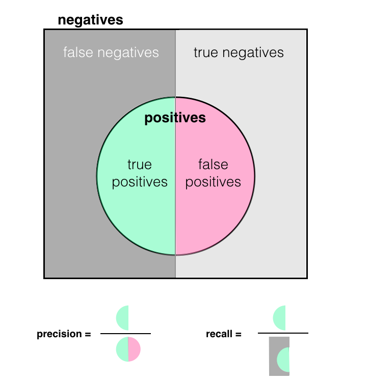

**Precision & Recall**

Precision and recall are just different metrics for measuring the "success" or performance of a trained model.

* precision is defined as the number of true positives (truly fraudulent transaction data, in this case) over all positives, and will be the higher when the amount of false positives is low.
* recall is defined as the number of true positives over true positives plus false negatives and will be higher when the number of false negatives is low.
Both take into account true positives and will be higher for high, positive accuracy, too.

I find it helpful to look at the below image to wrap my head around these measurements:

In many cases, it may be worthwhile to optimize for a higher recall or precision, which gives you a more granular look at false positives and negatives.
