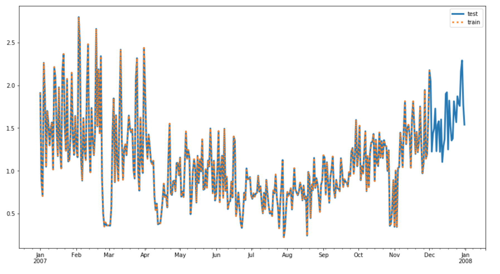

### Splitting in Time
In general, we can create training data by taking each of our complete time series and leaving off the last `prediction_length` data points to create corresponding, training time series.

In code this looks like this:
```python
def create_training_series(complete_time_series, prediction_length):
    '''Given a complete list of time series data, create training time series.
       :param complete_time_series: A list of all complete time series.
       :param prediction_length: The number of points we want to predict.
       :return: A list of training time series.
       '''
    # get training series
    time_series_training = []

    for ts in complete_time_series:
        # truncate trailing `prediction_length` pts
        time_series_training.append(ts[:-prediction_length])

    return time_series_training
```
DeepAR will train on the provided data looking at different intervals that are `context_length` number of points as input and the next `prediction_length` number of points as output. It selects the context from the given, truncated training data, which is why it is important to leave off the last prediction_length points.

### Training and Test Series

We can visualize what these series look like, by plotting the train/test series on the same axis. We should see that the test series contains all of our data in a year, and a training series contains all but the last prediction_length points. Below are train/test series for 2007.


